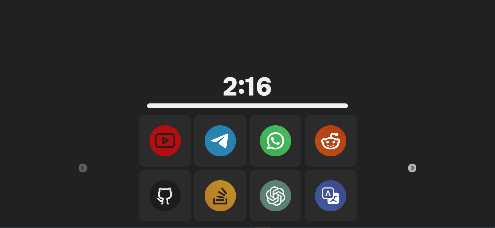
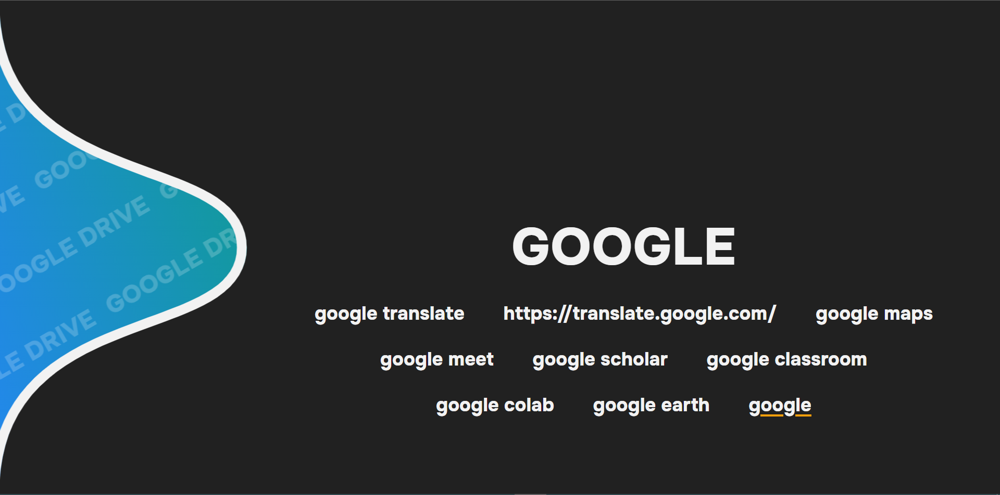
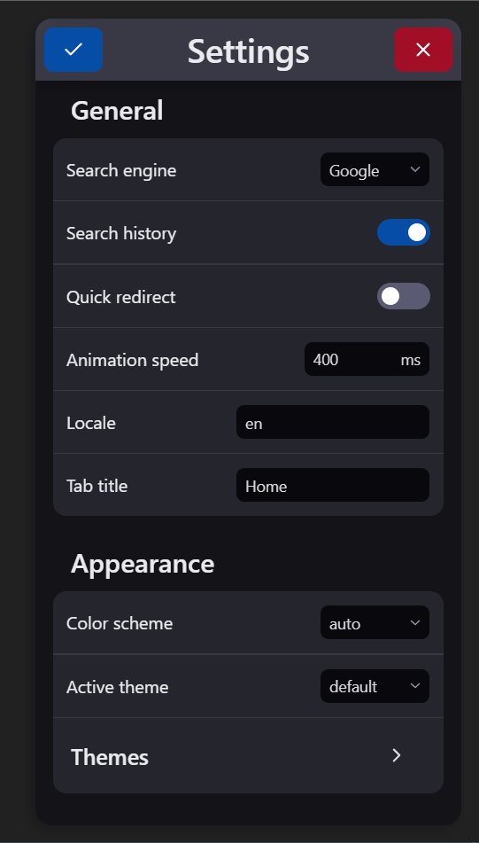
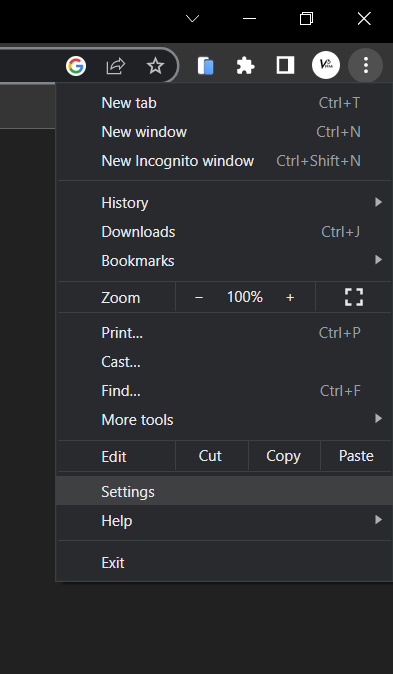
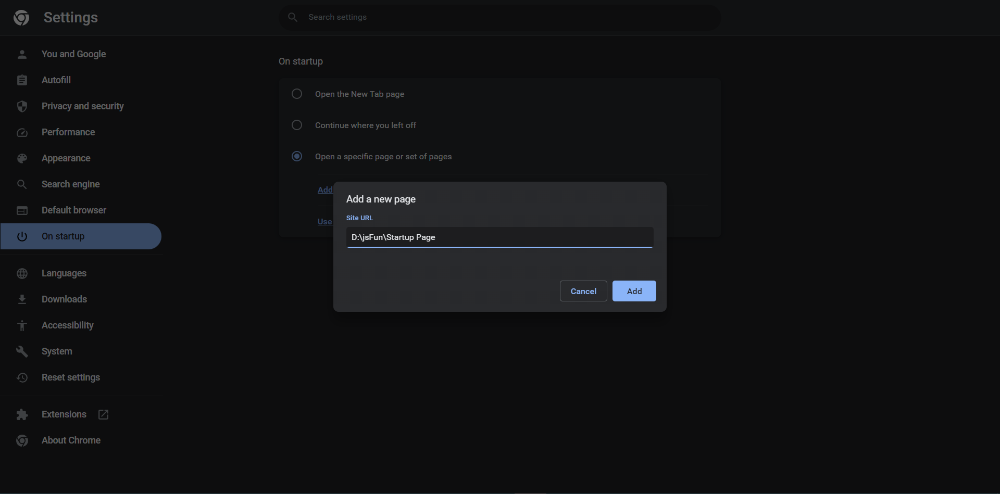

## Browser Startup Page JS
 A Customised Startup page for Web Browser

 * Custom web app widgets and redirections

 * Custom Search bar with search facility and suggestions
 

 * Custom theme Setting facility

 >> ---
 ### How to set Custom Startup page
 * Go to options in chrome browser > go to Settings
 
 * On Settings, go to On startup > click - Open a specific page or set of pages > paste the file path into the input box
 
 * And Done
   >>---
   ## Thankyou!!!...
